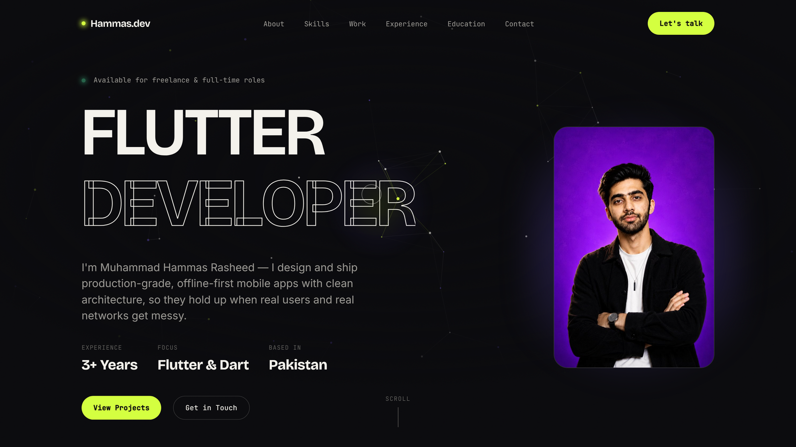
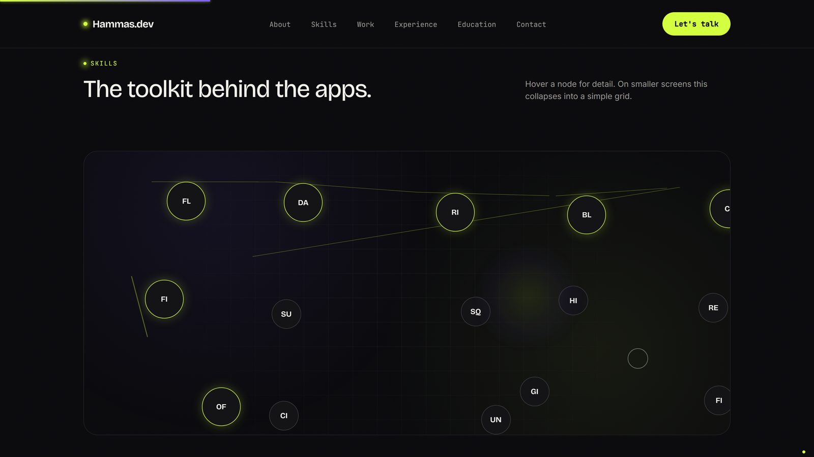
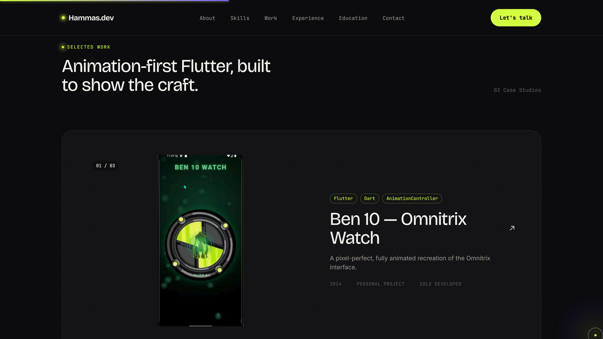
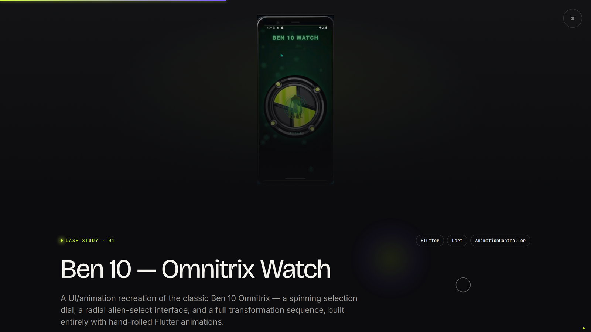

<div align="center">

# Muhammad Hammas Rasheed — Portfolio

### A Flutter developer's portfolio, built without a single framework.

Pure HTML5, CSS3, and vanilla JavaScript (ES6+) — GSAP-driven animation, a Canvas2D particle hero, a three-layer custom cursor, and scroll-choreographed sections, running at 60fps with zero build step.

[](#)
[](#)
[](#)
[](#)
[](#)
[](#license)

[](https://github.com/HammasT1/Portfolio-Showcase-Website/commits)
[](#)
[](https://github.com/HammasT1/Portfolio-Showcase-Website/issues)

**[Live Site](#)** &nbsp;·&nbsp; **[Report a Bug](https://github.com/HammasT1/Portfolio-Showcase-Website/issues)** &nbsp;·&nbsp; **[Contact](mailto:muhammadhammasrasheed@gmail.com)**

<br />



*Hero → About → Skills → Projects → Experience → Education → Contact, all on one scroll.*

</div>

> [!NOTE]
> The **Live Site** link above is still a placeholder — the project hasn't been deployed yet. Ship it to Vercel, Netlify, or GitHub Pages (all work with zero config, since there's no build step) and swap the link in.

<br />

## 📋 Table of Contents

- [Overview](#overview)
- [A Closer Look](#a-closer-look)
- [Features](#features)
- [Tech Stack](#tech-stack)
- [Project Structure](#project-structure)
- [Getting Started](#getting-started)
- [Design System](#design-system)
- [Performance & Accessibility](#performance--accessibility)
- [Roadmap](#roadmap)
- [About the Developer](#about-the-developer)
- [License](#license)

<br />

## 🎯 Overview

This is my personal portfolio — built to demonstrate the same care I put into production Flutter apps, just in a different toolset. No React, no build pipeline, no animation library doing the heavy lifting beyond GSAP: the point was to show fundamentals, not hide behind a framework.

It's a single `index.html` you can open directly, or serve with anything — there's nothing to compile.

<br />

## 🖼️ A Closer Look

<table>
<tr>
<td width="33%"><br /><sub align="center">An interactive constellation instead of progress bars — hover a node, watch the connector lines draw themselves in on scroll.</sub></td>
<td width="33%"><br /><sub>Project cards with 3D cursor-tilt and cursor-following media parallax.</sub></td>
<td width="33%"><br /><sub>Clicking a card morphs it into a full case study via a hand-rolled FLIP transition — no plugin.</sub></td>
</tr>
</table>

<br />

## ✨ Features

<details open>
<summary><strong>Signature animation system</strong></summary>
<br />

- 🌌 A generative particle constellation in the hero, rendered on Canvas2D — particles drift, link to nearby neighbors, react to the cursor, and pulse outward when a CTA button is hovered
- 🖱️ A three-layer custom cursor (dot → ring → soft blurred glow), each trailing with progressively more lag
- 🧲 Magnetic buttons/links that pull toward the cursor within a radius
- 🎴 A continuous 3D perspective tilt on project cards, tracking the cursor live
- ✂️ Hand-built text-splitting for per-character and per-word reveals — no paid SplitText plugin
- 📜 A genuine GSAP ScrollTrigger `pin` (About section) plus scrubbed parallax (hero depth, timeline progress, project media)
- 📖 A scroll-scrubbed "read-along" effect in About — words brighten in sequence as the paragraph scrolls through view
- 📊 A gradient progress bar tracking scroll position, fixed to the top of the viewport
- ✨ A hand-drawn SVG constellation connecting core skills, stroke-animated on scroll entrance
- 🔄 A custom FLIP-style morph transition — project cards expand into full case studies via hand-rolled `getBoundingClientRect` diffing
- 🔤 Scramble-text hover on nav/footer links (cycles random characters before resolving)
- 🎉 A confetti burst on successful contact-form submission
- 🎞️ An infinite marquee strip in the footer
- 🎬 A one-time-per-session preloader (via `sessionStorage`, never annoys a returning visitor)

</details>

<details>
<summary><strong>Sections</strong></summary>
<br />

Hero (with author photo), About, Skills (interactive constellation), Projects (case-study grid + detail overlay), Experience timeline, Education & Certifications, Contact (animated form, wired to a real backend).

</details>

<details>
<summary><strong>Built to actually ship</strong></summary>
<br />

- Respects `prefers-reduced-motion` everywhere — every animation has a static fallback, not just the obvious ones
- Degrades gracefully if the GSAP CDN fails to load — content stays visible rather than getting stuck hidden behind a class waiting for JS that never arrives
- Lenis smooth scroll wired directly into GSAP's ticker (no competing rAF loops)
- Mobile fallbacks that simplify rather than fake the desktop experience (e.g. Skills' constellation becomes a plain chip grid; the About pin and hero photo only engage above certain breakpoints)
- Every interactive bug found during development was confirmed and fixed against a real running instance of the site, not just read from the code — including a project-overlay close race condition and a stuck-`opacity:0` reveal bug

</details>

<br />

## 🛠️ Tech Stack

| Layer | Choice |
|---|---|
| Structure | Semantic HTML5 |
| Styling | CSS3 — custom properties, Grid/Flexbox, no preprocessor |
| Behavior | Vanilla JavaScript (ES6+), plain `<script>` tags — no bundler, no modules (keeps it runnable straight from `file://`) |
| Animation | [GSAP](https://gsap.com/) + [ScrollTrigger](https://gsap.com/docs/v3/Plugins/ScrollTrigger/) |
| Smooth scroll | [Lenis](https://lenis.darkroom.engineering/) |
| Forms | [Formspree](https://formspree.io/) |
| Fonts | [Bricolage Grotesque](https://fonts.google.com/specimen/Bricolage+Grotesque) (display) · [Inter](https://fonts.google.com/specimen/Inter) (body) · [JetBrains Mono](https://fonts.google.com/specimen/JetBrains+Mono) (labels/mono) |

No build tools, no `package.json`, no `node_modules` — every dependency loads from a CDN via a plain `<script>` tag.

<br />

## 📁 Project Structure

<details>
<summary>Expand file tree</summary>

```
Portfolio-Showcase-Website/
├── index.html                  # Single entry point — all sections, in order
├── css/
│   ├── reset.css                # Minimal modern reset
│   ├── variables.css            # Design tokens — color, type, spacing, motion
│   ├── base.css                 # Global element styling + utility classes
│   ├── animations.css           # Shared keyframes, Lenis scaffolding
│   ├── cursor.css                # Custom cursor (dot / ring / glow)
│   ├── preloader.css
│   ├── layout.css                # Header, footer, buttons, scroll progress, grain overlay
│   ├── hero.css
│   ├── about.css
│   ├── skills.css
│   ├── projects.css
│   ├── project-detail.css        # Full-screen case-study overlay
│   ├── timeline.css
│   ├── education.css
│   └── contact.css
├── js/
│   ├── utils.js                  # lerp, clamp, debounce, splitText, scrambleText, confettiBurst…
│   ├── data/
│   │   ├── projects-data.js      # Project case-study content
│   │   └── skills-data.js
│   ├── preloader.js
│   ├── smooth-scroll.js           # Lenis + GSAP ticker integration
│   ├── cursor.js
│   ├── magnetic.js
│   ├── nav.js                     # Header behavior + scramble-hover binding
│   ├── footer.js                  # Marquee + footer link scramble-hover
│   ├── hero-canvas.js             # Particle constellation + button ripple pulses
│   ├── text-animations.js         # Hero title + heading + About read-along reveals
│   ├── scroll-animations.js       # Generic [data-reveal], counters, pin, parallax, progress bar
│   ├── skills.js                  # Constellation render + entrance + idle float
│   ├── projects.js                # Card render + 3D tilt + FLIP morph transition
│   ├── timeline.js
│   ├── contact-form.js            # Validation + Formspree submit + ambient blobs
│   └── main.js                    # Init orchestration
├── assets/
│   ├── pictures/                  # Author photo
│   ├── projects/                  # Real project screenshots
│   └── certifications/            # Certificate images
└── preview/                        # README screenshots
```

</details>

<br />

## 🚀 Getting Started

No installation required.

```bash
git clone https://github.com/HammasT1/Portfolio-Showcase-Website.git
cd Portfolio-Showcase-Website
```

Then either:

- **Just open it** — double-click `index.html`, or
- **Serve it locally** (recommended, avoids any `file://` quirks in some browsers):

```bash
# with Python
python -m http.server 5500

# or with Node
npx serve .
```

Then visit `http://localhost:5500`.

<br />

## 🎨 Design System

**Palette**

| | Token | Hex | Usage |
|---|---|---|---|
|  | `--color-bg` | `#0b0b0e` | Near-black base |
|  | `--color-text` | `#f4f2ec` | Warm off-white text |
|  | `--color-accent` | `#d4ff3f` | Electric-lime accent, glow |
|  | `--color-accent-2` | `#7c5cff` | Violet secondary, gradients |

**Type** — Bricolage Grotesque for headings, Inter for body copy, JetBrains Mono for labels/tags/eyebrows.

**Motion** — spring/expo easing throughout (`power4.out`, `back.out`, `elastic.out`), never linear defaults; every animated property is `transform`/`opacity`-only for GPU acceleration.

<br />

## ⚡ Performance & Accessibility

- `prefers-reduced-motion: reduce` is checked in every animation module — reduced-motion visitors get the final state instantly, not a stripped-down version of the animation
- Images fall back to runtime-generated SVG data URIs (see `utils.placeholderImage`) only when a project has no real screenshot yet — all three current case studies use real ones
- Semantic landmarks, a skip-to-content link, `aria-label`s on icon-only controls, and `aria-hidden` on purely decorative layers (grain overlay, cursor, background canvas)
- The custom cursor and all pointer-driven effects are disabled outright on touch/coarse-pointer devices — no simplified-but-still-present version fighting real touch input

<br />

## 🗺️ Roadmap

**Shipped since the initial build:**

- [x] Real GitHub, LinkedIn, and X profile links
- [x] Real Coursera certificate verification links (all three certifications)
- [x] Real project screenshots for card thumbnails and case-study hero banners
- [x] Author photo in the hero
- [x] Contact form wired to a real backend (Formspree) — verified with a live test submission
- [x] Scroll progress bar, 3D card tilt, confetti burst, and hero button ripple pulses

**Still open:**

- [ ] Deploy (Vercel / Netlify / GitHub Pages) and swap in the live URL
- [ ] Add the Dino Flutter repo link once it's public
- [ ] Add more real in-app screenshots to each project's gallery section

<br />

## 👤 About the Developer


**Muhammad Hammas Rasheed** — Flutter developer, 3+ years building offline-first, production-grade mobile apps with clean architecture and Riverpod/BLoC. Computer Science undergraduate at the University of Engineering & Technology, Taxila.

- 📧 [muhammadhammasrasheed@gmail.com](mailto:muhammadhammasrasheed@gmail.com)
- 💻 [github.com/HammasT1](https://github.com/HammasT1)

<br clear="right" />

## 📄 License

Distributed under the [MIT License](LICENSE) — added as a default since most of my other repos use it; swap it out if you'd rather use something else. Feel free to use this as a structural reference for your own portfolio — please don't copy the content wholesale.

<br />

<div align="center">

Built with care, one `AnimationController` at a time.

</div>
